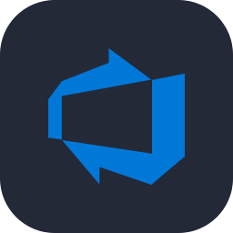
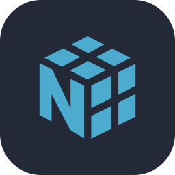
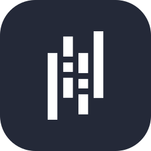

# Hozan

**Full-Stack & Cloud Developer** · Computer Science @ Université Laval · Quebec City, Canada

---

### 👋 About me

I build web applications end to end and the cloud infrastructure that runs them.
Three years in the Quebec public service across cloud and software development — IaC, CI/CD pipelines, AWS, Terraform, Azure DevOps — plus personal projects built with TypeScript, React and Node.js.

### 🎯 Focus areas

| 🧩 Full-Stack | ☁️ Cloud & DevOps | 🧠 Machine Learning |
| :-- | :-- | :-- |
| TypeScript, React, Node.js, .NET | AWS, Terraform, Docker, CI/CD | Python, PyTorch, NumPy, Pandas |

### 🛠️ Tech stack

**Languages**

**Web**

   

**Cloud & DevOps**

   

**Databases**

**Machine Learning**

    

### 💼 Experience

**Cloud Developer** — Quebec Ministry of Cybersecurity and Digital Technology · *2024 – Present*
Automating the deployment and hosting of government services on AWS, from development all the way to production.
`AWS` `Terraform` `Docker` `CI/CD` `Azure DevOps` `Artifactory`

**Full-Stack Developer** — Quebec Ministry of Justice · *2023 – 2024*
Built a monitoring dashboard end to end, from the database to the frontend, shipped to production and used daily.
`C#` `.NET` `Blazor` `Entity Framework` `SQL` `Azure Functions` `Azure DevOps`

### 📚 Education & certifications

- 🎓 B.Sc. Computer Science — Université Laval
- ☁️ AWS Certified Solutions Architect – Associate *(in progress)*
- 🤖 Machine Learning — Andrew Ng (Stanford) · Hugo Larochelle (Université de Sherbrooke)

### 🌐 Languages

English · French · Spanish · Turkish

---

Open to full-stack and cloud opportunities in Canada and the U.S.

